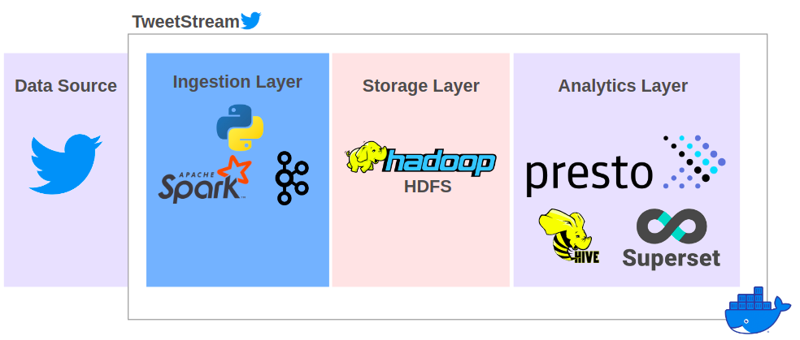
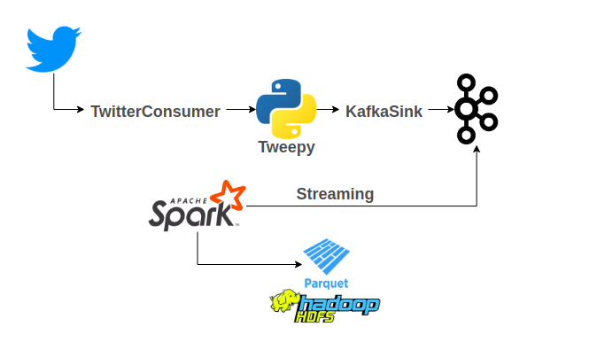

#  Tweetstream 

A simple stack for Twitter Analytics.

## Architecture (To-Be)
Tweetstream is segregated in distinct layers which are coupled in a `docker-compose` deployment.

- **Ingestion Layer:** all logic and infrastructure for collecting and writing data from twitter.
- **Storage Layer:** we store data as parquet files in HDFS
- **Analytics Layer:** the analytics layer provides tools for querying and analyzing ingested data, using standard SQL.

### Twitter Streaming
Using `tweepy`, ingestion layer streams tweets, filtering them by desired hashtags. These tweets are sent to Kafka using the `KafkaSink`. 
Then, it consumes the tweets from `twitter` topic using Spark Streaming and writes them as `parquet` files to HDFS. 
This simple diagram illustrates the flow:

### Usage
All code and flow can deployed locally using `docker-compose`.

### ToDos
- [ ] Write many more tests
- [ ] Write Usage
- [ ] Files to deploy on K8s
- [ ] Implement a generic sink for TwitterConsumer
- [ ] Makefile with build and deploy services
- [ ] Use spark operator over spark cluster defined in docker-compose
